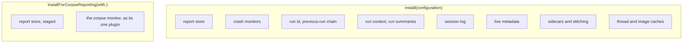
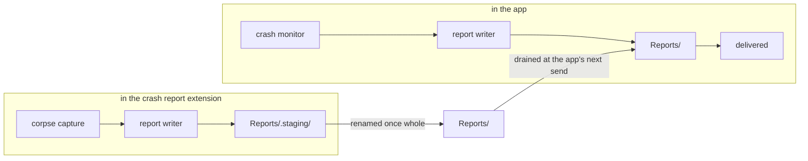

# Install Modes and Report Areas

KSCrash installs in one of two modes, and they differ in kind rather than in
size. The ordinary install arms crash detection for the process it runs in and
records everything about that process's run. The corpse-reporting install arms
nothing, because the process it reports on is already dead.

Getting this distinction wrong is easy, because both installs are methods on the
same shared object. The rule to hold on to: an *extension* is a place, not a
mode. An ordinary extension, a widget or a share sheet, is user code that can
crash and should install normally. Only a crash report extension, which is
handed other processes' corpses, installs for corpse reporting.

## What each install stands up



Everything the corpse install leaves out follows from the process it serves,
not from saving work:

- **No run of its own.** A capture adopts the crashed run's identity out of the
  corpse, so a run id minted here would be the wrong one.
- **No run context, summaries or sessions.** Those describe the app's life, and
  the app records them for itself.
- **No metadata store.** Setting metadata or a user id in this process is not
  supported, and asserts in debug builds.
- **No crash monitors.** A crash report extension does not report on itself.
- **No sidecars or stitching.** A corpse report carries its data with it, and
  the app stitches at read time.
- **No thread or dynamic-linker caches.** Both would describe this process,
  while the frames belong to another one.

## Where a report lands

The app reads a corpse store by renaming files out of a directory that another
process may still be writing into, and the two share no lock. Staging is what
makes that safe: the store writes below `Reports` in a dot directory the app's
ingest skips, and a finished report is renamed up as its last step, so a file
only becomes visible once it is whole.



Only the capture path performs that rename. A report produced any other way in
a corpse-reporting process stays in staging, where nothing will find it, which
is one more reason the app-facing API does not belong in that process.

## One container, one directory per process

Every install of either kind roots itself at
`<container>/KSCrash/<namespace>/<bundle id>/`. The bundle id component is what
keeps processes sharing an app group from colliding, and it is why an ordinary
extension can install normally beside the app with no new mechanism.

```
<app group container>/KSCrash/<namespace>/
├── com.example.app/                  the app, ordinary install
│   ├── Reports/  Sidecars/  RunSidecars/  Runs/  Data/
│   └── store.json                    { "schema": 1, "kind": "self" }
├── com.example.widget/               an ordinary extension, ordinary install
│   ├── Reports/  Sidecars/  RunSidecars/  Runs/  Data/
│   └── store.json                    { "schema": 1, "kind": "self" }
└── com.example.crashreporter/        the crash report extension
    ├── Reports/  Reports/.staging/
    └── store.json                    { "schema": 1, "kind": "corpse" }
```

Every store says what it is for in `store.json`, written by its own install. A
kind of `self` means the owning process delivers its own reports and nobody else
may take them, because they are stitched from sidecars and run data that live in
that same store; a report moved without them arrives explaining nothing. A kind
of `corpse` means the reports describe other processes, arrive complete, and are
meant to be drained.

The app drains a sibling only when its declaration says `corpse`, and leaves
alone any kind or schema version it does not recognise. Nothing is inferred from
the directory layout, so the staging directory stays an implementation detail
rather than a signal other processes depend on. If you later want an extension's
own crashes delivered by the app rather than by the extension, that is a
delivery policy to add to the declaration, not something to infer.

## What is meaningful in a corpse-reporting process

| Call | In a corpse-reporting process |
| ---- | ----------------------------- |
| `captureCrashReport(from:)` | the whole point |
| `metadata`, `setUserID(_:)` | unsupported; asserts in debug |
| `reportException(...)` | writes a report nothing will read |
| `sendReports`, `sendRunSummaries` | the app's job, not the extension's |
| `hangEvents` | never yields; no hang monitor exists |
| `runID`, `sessionID`, `previousTerminationReason` | empty, correctly: this process owns no run |

If you find yourself wanting any row but the first, you want an ordinary
install in that process.
