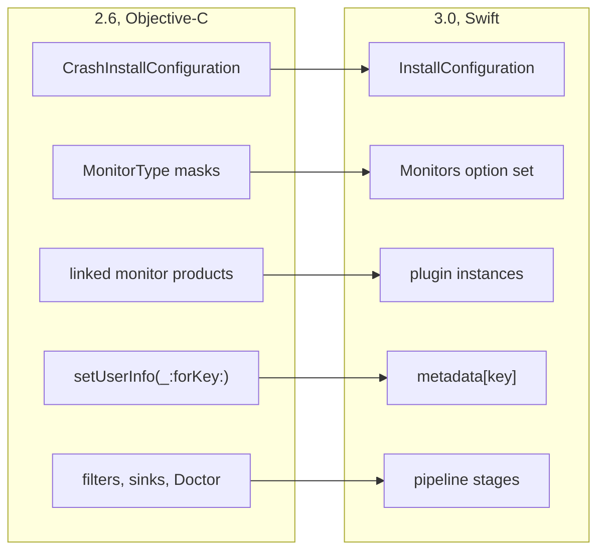

# Migration Guide: KSCrash 2.6 to 3.0

KSCrash 3.0 replaces the Objective-C front end with a Swift API. The C recording
core, the on-disk report contents, and the crash-time behavior are unchanged;
what changed is how you install, configure, and talk to KSCrash at runtime.

Unlike 2.6, **3.0 is source-breaking**: the ObjC facade (`KSCrash.h`,
`KSCrashInstallConfiguration`, `KSCrashReportStore`) is gone, with no deprecated
aliases. Migration is mechanical; this guide maps every removed surface to its
replacement, and nothing else. For the capabilities 3.0 adds, see
[What's New in KSCrash 3.0](Whats-New-in-KSCrash-3.0).

## What moved



Every arrow is a rename or a reshape of the same capability, not a new idea to
learn. What the picture leaves out is the point of it: the C recording core,
the on-disk report format and the crash-time behaviour are untouched, which is
why reports written by 2.6 still read in 3.0.

## What to change in Package.swift

The first thing you hit is the dependency list, because five products are gone
and two are renamed.

| 2.6 product | 3.0 |
| ----------------------------------------------- | ----------------------------------------------- |
| `Recording`                                     | `Recording`, and add `KSCrash` for install and send |
| `Installations`                                 | gone, `KSCrash` installs and sends              |
| `Filters`, `Sinks`, `DemangleFilter`, `Reporting` | gone, replaced by pipeline stages you write   |
| `DiscSpaceMonitor`                              | `DiskMonitor` (`import KSCrashDiskMonitor`)     |
| `BootTimeMonitor`                               | `BootMonitor` (`import KSCrashBootMonitor`)     |
| `Monitors`, `Profiler`, `Report`, `RecordingCore` | unchanged                                     |
| new                                             | `MonitorPlugins`, for writing your own monitor  |
| new                                             | `CrashReportExtension`, for iOS 27 crash extensions |

## Install

```swift
// 2.6
import KSCrashRecording
let config = CrashInstallConfiguration()
config.installPath = myPath
try KSCrash.shared.install(with: config)

// 3.0
import KSCrash
let config = InstallConfiguration(namespace: "MyApp")
try KSCrash.shared.install(config)
```

`InstallConfiguration` is a value type with one required argument, the
**namespace**: KSCrash derives its whole directory tree from it
(`<container>/KSCrash/<namespace>/<bundleID>/…`), so there is no `installPath`.
Pick where the tree lives with `config.container`: `.default`
(Application Support; Caches on tvOS), `.caches`, `.appGroup("group.id")`, or
`.url(customBase)`. `config.locations` returns the resolved directories
(`root`, `reports`, `runs`, …) without installing.

| 2.6                                   | 3.0                                        |
| ------------------------------------- | ------------------------------------------ |
| `installPath`                         | `namespace` + `container`                  |
| `enableQueueNameSearch`               | `searchesQueueNames`                       |
| `enableMemoryIntrospection` + `doNotIntrospectClasses` | `memoryIntrospection` (`.disabled` / `.enabled(excludingClasses:)`) |
| `addConsoleLogToReport`               | `includesConsoleLog`                       |
| `printPreviousLogOnStartup`           | `printsPreviousLog`                        |
| `enableSwapCxaThrow`                  | `swapsCxaThrow`                            |
| `enableSwiftAsyncStackTraces`         | `usesSwiftAsyncStackTraces`                |
| `enableHangReporting`                 | `reportsResolvedHangs`                     |
| `enableCPUExceptionReporting`         | `reportsCPUExceptions`                     |
| `enableCompactBinaryImages`           | `compactsBinaryImages`                     |
| `userInfoJSON` install seed           | removed; set `KSCrash.shared.metadata` after install |
| `maxReportCount` default 5            | default 50 (`maxRunSummaryCount` likewise) |
| `isWritingReportCallback` etc. on the config | `unsafeCrashTimeCallbacks` (see below)  |

Install throws `InstallError` (`.alreadyInstalled`, `.invalidConfiguration(…)`,
`.containerUnavailable(…)`, …) instead of `KSCrashInstallError` codes.

## Monitors

`MonitorType` masks and the composite sets (`.productionSafe`, `.required`,
`.optional`, …) are replaced by the `Monitors` option set with seven detectors:

```swift
config.monitors = .default            // everything but zombies
config.monitors = [.machExceptions, .signals, .nsExceptions, .hangs]
```

| 2.6 `MonitorType`      | 3.0 `Monitors`     |
| ---------------------- | ------------------ |
| `.machException`       | `.machExceptions`  |
| `.signal`              | `.signals`         |
| `.cppException`        | `.cppExceptions`   |
| `.nsException`         | `.nsExceptions`    |
| `.watchdog`            | `.hangs`           |
| `.termination`        | `.terminations`    |
| `.zombie`             | `.zombies`         |
| `.userReported`        | always on          |
| `.system`, `.applicationState` (infrastructure) | always on |
| composites (`.all`, `.productionSafe`, …) | `.default`, `.all`, or build your own set |

UserReported and the infrastructure monitors (System, Lifecycle, UserInfo,
Resource) can no longer be turned off; they capture nothing on their own.

## Plugins

Linking `DiscSpaceMonitor` or `BootTimeMonitor` no longer enables anything, and
the `Monitors.metricKit` singleton is gone. Optional monitors are plugin
*instances*:

```swift
config.plugins = [DiskMonitor.plugin(), BootMonitor.plugin(), MetricKitMonitor.plugin()]
// later:
let metricKit = KSCrash.shared.installedPlugin(MetricKitMonitor.self)
```

The products are renamed `DiskMonitor` and `BootMonitor` (`import
KSCrashDiskMonitor` / `KSCrashBootMonitor`); both are pure Swift now, and
`storage` / `freeStorage` / `boot_time` land in the report's `system` section
at delivery. Custom monitors conform to
`MonitorPlugin` (module `KSCrashMonitorPlugins`); a C monitor table wraps in
`CMonitorPlugin(api:)`.

## Runtime surface

| 2.6                                          | 3.0                                            |
| -------------------------------------------- | ---------------------------------------------- |
| `setUserInfo(_:forKey:)` / per-key getters   | `KSCrash.shared.metadata["key"] = value` (a typed `MetadataStore`; same crash-safe store underneath, and it now holds arrays and dictionaries as well as scalars) |
| `crashedLastLaunch`                          | `previousTerminationReason.isAbnormal`         |
| `activeDurationSinceLaunch` / `backgroundDurationSinceLaunch` | `RunSummary.durations.activeMs` / `.backgroundMs` |
| `sessionsSinceLaunch` and the `…SinceLastCrash` counters | derived from run summaries, see below |
| `reportUserException(...)`                   | `reportException(_:reason:language:lineOfCode:stackTrace:logAllThreads:terminateProgram:)` |
| `report(_ exception:logAllThreads:)`         | `reportException(_ exception:logAllThreads:)`  |
| `KSCrash+Hang.h` `addHangObserver:`          | `KSCrash.shared.hangEvents` (an `AsyncStream<HangEvent>`) |
| `KSCrash+Backtrace.h`                        | `Backtrace.capture(thread:maxFrames:)`, `Backtrace.symbolicate(_:)` |
| filters, sinks, `KSCrashDoctor`              | pipeline stages (see Reports and sending)      |
| `userID` setter                              | `setUserID(_:)` (unchanged meaning: metadata key + session boundary) |
| `systemInfo` dictionary                      | removed; the data is on every report's `system` section |

`runID`, `previousRunID`, and `sessionID` remain, now typed
(`RunSummary.ID`).

## Crash-time callbacks

The three callbacks move off the configuration's top level into
`UnsafeCrashTimeCallbacks`, named for what they are; the C function types are
unchanged, and everything in them must stay async-signal-safe:

```swift
var callbacks = UnsafeCrashTimeCallbacks()
callbacks.isWritingReport = { plan, writer in ... }   // C convention, no captures
config.unsafeCrashTimeCallbacks = callbacks
```

`didWriteReport` now receives the report id as a string (`const char *`)
instead of an `int64_t`.

## Reports and sending

Report identity changed: `ReportID` (an `Int64`) is gone. Reports are keyed by
`Report.ID`, a validated UUID that is also written into the report as
`report.id`, and filenames are `<timestamp>-<UUID>.json`. `CrashReportStore` is
gone with it; reading and deleting go through the async Swift send. A report
also carries `report.session_id`, the session open when it was finalized.

The Objective-C send is retired along with everything that plugged into it. The
`Filters`, `Sinks`, `DemangleFilter`, `Installations` and `ReportingCore`
products no longer exist, and neither does `KSCrashDoctor`. If you built a
delivery path out of filters and sinks, it becomes a pipeline of stages:

```swift
var send = SendConfiguration()
send.reportPipeline = [.init(MyUploadStage())]
send.runSummaryPipeline = [.init(MySummaryStage())]
let result = try await KSCrash.shared.sendReports(with: send)
```

A stage receives one payload at a time and returns what happens to it, so
keeping a report on disk for a later attempt is a return value rather than a
sink that quietly swallows it. `sendReports(with:only:)` sends a named subset.

## The report model

`CrashReport` is now `Report`, and it is no longer generic over a user-data
type. The section 2.6 called `user` is `metadata` on the model, typed as
`Metadata` rather than a raw dictionary. Values a monitor wrote that the model
does not know are preserved rather than dropped: they read back through
`monitorData(_:for:)` under `crash.error.monitor_data.<id>` and the report's own
`monitor_data` namespace.

Nulls and containers behave differently from 2.6, and that is described in
[What's New](Whats-New-in-KSCrash-3.0#metadata-holds-containers-and-reports-hold-no-nulls).

## Where the launch counters went

3.0 records one telemetry summary per process run (see
[What's New](Whats-New-in-KSCrash-3.0#run-summaries)); the counters that used to
hang off `KSCrash.shared` are read off those instead.

A summary covers exactly one run, so the per-launch durations map straight
across: `durations.activeMs` and `durations.backgroundMs` are what
`activeDurationSinceLaunch` and `backgroundDurationSinceLaunch` returned.

The four `…SinceLastCrash` values are derived rather than stored. Every summary
carries `outcome.terminationReason` and `sessions.records`, so walk the
summaries back to the most recent crashed run and aggregate:

| 2.6 | derive from summaries |
| ---------------------------------- | ------------------------------------------- |
| `launchesSinceLastCrash`           | how many summaries you walked               |
| `sessionsSinceLastCrash`           | total `sessions.records` across them        |
| `activeDurationSinceLastCrash`     | sum of `durations.activeMs`                 |
| `backgroundDurationSinceLastCrash` | sum of `durations.backgroundMs`             |

This is deliberate rather than an omission. Keeping them live would mean the
SDK holding counters across runs that the summary stream already describes,
and the backend is where that aggregation belongs.

## Deployment floor

3.0 requires iOS 15, tvOS 15, watchOS 8, macOS 12, visionOS 1 (from iOS 13 /
tvOS 13 / watchOS 6 / macOS 10.15).

## If you were on the C API

`kscrash_install(installPath, KSCrashCConfiguration)` still exists and is the
supported path for embedders that cannot take Swift (the namespaced-library
setup uses it). The C user-info setters are gone; metadata is Swift-only.

## Removed API index

The sections above map capabilities. This is the symbol-by-symbol version, for
working through a compiler's error list.

`KSCrash` instance API:

| 2.6 | 3.0 |
| --------------------------------- | ------------------------------------------- |
| `installWithConfiguration:`       | `install(_ configuration: InstallConfiguration)` |
| `reportUserException:`            | `reportException(_:reason:language:lineOfCode:stackTrace:logAllThreads:terminateProgram:)` |
| `reportNSException:`              | `reportException(_:logAllThreads:)`         |
| `uncaughtExceptionHandler`        | removed, KSCrash installs its own           |
| `crashedLastLaunch`               | `previousTerminationReason.isAbnormal`      |
| `systemInfo`                      | removed, on every report's `system` section |
| `reportStore`                     | `Store`, reached through the send           |
| `sessionsSinceLaunch`, `launchesSinceLastCrash`, `sessionsSinceLastCrash`, `activeDuration…`, `backgroundDuration…` | run summaries, see Run summaries |

User info, all replaced by `KSCrash.shared.metadata["key"]`:

`setUserInfoString:`, `setUserInfoBool:`, `setUserInfoDate:`,
`setUserInfoDouble:`, `setUserInfoInteger:`,
`setUserInfoUnsignedInteger:`, `removeUserInfoValueForKey:`.

Backtrace:

| 2.6 | 3.0 |
| ---------------------------------- | ------------------------------------ |
| `captureBacktraceFromThread:`      | `Backtrace.capture(thread:maxFrames:)` |
| `captureBacktraceFromMachThread:`  | `Backtrace.capture(machThread:maxFrames:)` |
| `symbolicateAddress:`              | `Backtrace.symbolicate(_:)`          |
| `quickSymbolicateAddress:`         | `Backtrace.quickSymbolicate(_:)`     |

Hang observation: `addHangObserver:` becomes `KSCrash.shared.hangEvents`, an
`AsyncStream<HangEvent>`.

Report store, all replaced by the Swift `Store` and the async send:

`storeWithConfiguration:`, `defaultStoreWithError:`, `defaultInstallSubfolder`,
`reportCount`, `reportIDs`, `nextReportID`, `reportForID:`, `reportDataForID:`,
`deleteReportWithID:`, `deleteAllReports`, `sendAllReportsWithCompletion:`,
`sendReportWithID:`, `sink`, `reportCleanupPolicy`,
`cleanupOrphanedRunSidecars`.

Plugins: `KSCrashBasicMonitorPlugin`, `pluginWithAPI:` and `initWithAPI:` become
the `MonitorPlugin` protocol in `KSCrashMonitorPlugins`, with `CMonitorPlugin(api:)`
wrapping a C monitor table.

Whole products, covered above rather than symbol by symbol: `Installations`
(the `KSCrashInstallation` classes), `Filters` (every `KSCrashReportFilter*`,
including `KSCrashDoctor`), `Sinks` (every `KSCrashReportSink*`),
`DemangleFilter`, and `Reporting` (`KSHTTPRequestSender`, `KSReachabilityKSCrash`
and the other delivery helpers). Their replacement is a `PipelineStage` you
write, or your own networking.
