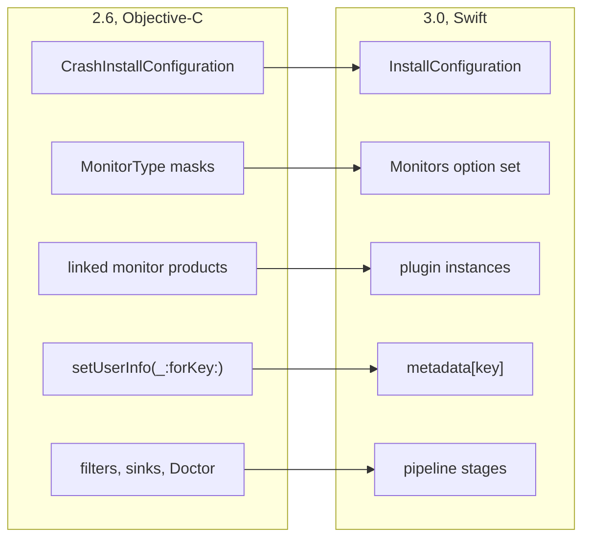
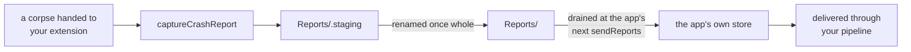

# Migration Guide: KSCrash 2.6 to 3.0

KSCrash 3.0 replaces the Objective-C front end with a Swift API. The C recording
core, the on-disk report contents, and the crash-time behavior are unchanged;
what changed is how you install, configure, and talk to KSCrash at runtime.

Unlike 2.6, **3.0 is source-breaking**: the ObjC facade (`KSCrash.h`,
`KSCrashInstallConfiguration`, `KSCrashReportStore`) is gone, with no deprecated
aliases. Migration is mechanical; this guide maps every removed surface to its
replacement.

## What moved



Every arrow is a rename or a reshape of the same capability, not a new idea to
learn. What the picture leaves out is the point of it: the C recording core,
the on-disk report format and the crash-time behaviour are untouched, which is
why reports written by 2.6 still read in 3.0.

## Install

```swift
// 2.6
import KSCrashRecording
let config = CrashInstallConfiguration()
config.installPath = myPath
try KSCrash.shared.install(with: config)

// 3.0
import KSCrash
var config = InstallConfiguration(namespace: "MyApp")
try KSCrash.shared.install(config)
```

`InstallConfiguration` is a value type with one required argument, the
**namespace**: KSCrash derives its whole directory tree from it
(`<container>/KSCrash/<namespace>/<bundleID>/…`), so there is no `installPath`.
Pick where the tree lives with `config.container`: `.default`
(Application Support; Caches on tvOS), `.caches`, `.appGroup("group.id")`, or
`.url(customBase)`. `config.locations` returns the resolved directories
(`root`, `reports`, `runs`, …) without installing.

| 2.6                                   | 3.0                                        |
| ------------------------------------- | ------------------------------------------ |
| `installPath`                         | `namespace` + `container`                  |
| `enableQueueNameSearch`               | `searchesQueueNames`                       |
| `enableMemoryIntrospection` + `doNotIntrospectClasses` | `memoryIntrospection` (`.disabled` / `.enabled(excludingClasses:)`) |
| `addConsoleLogToReport`               | `includesConsoleLog`                       |
| `printPreviousLogOnStartup`           | `printsPreviousLog`                        |
| `enableSwapCxaThrow`                  | `swapsCxaThrow`                            |
| `enableSwiftAsyncStackTraces`         | `usesSwiftAsyncStackTraces`                |
| `enableHangReporting`                 | `reportsResolvedHangs`                     |
| `enableCPUExceptionReporting`         | `reportsCPUExceptions`                     |
| `enableCompactBinaryImages`           | `compactsBinaryImages`                     |
| `userInfoJSON` install seed           | removed; set `KSCrash.shared.metadata` after install |
| `maxReportCount` default 5            | default 50 (`maxRunSummaryCount` likewise) |
| `isWritingReportCallback` etc. on the config | `unsafeCrashTimeCallbacks` (see below)  |

Install throws `InstallError` (`.alreadyInstalled`, `.invalidConfiguration(…)`,
`.containerUnavailable(…)`, …) instead of `KSCrashInstallError` codes.

## Monitors

`MonitorType` masks and the composite sets (`.productionSafe`, `.required`,
`.optional`, …) are replaced by the `Monitors` option set with seven detectors:

```swift
config.monitors = .default            // everything but zombies
config.monitors = [.machExceptions, .signals, .nsExceptions, .hangs]
```

| 2.6 `MonitorType`      | 3.0 `Monitors`     |
| ---------------------- | ------------------ |
| `.machException`       | `.machExceptions`  |
| `.signal`              | `.signals`         |
| `.cppException`        | `.cppExceptions`   |
| `.nsException`         | `.nsExceptions`    |
| `.watchdog`            | `.hangs`           |
| `.termination`        | `.terminations`    |
| `.zombie`             | `.zombies`         |
| `.userReported`        | always on          |
| `.system`, `.applicationState` (infrastructure) | always on |
| composites (`.all`, `.productionSafe`, …) | `.default`, `.all`, or build your own set |

UserReported and the infrastructure monitors (System, Lifecycle, UserInfo,
Resource) can no longer be turned off; they capture nothing on their own.

## Plugins

Linking `DiscSpaceMonitor` or `BootTimeMonitor` no longer enables anything, and
the `Monitors.metricKit` singleton is gone. Optional monitors are plugin
*instances*:

```swift
config.plugins = [DiskMonitor.plugin(), BootMonitor.plugin(), MetricKitMonitor.plugin()]
// later:
let metricKit = KSCrash.shared.installedPlugin(MetricKitMonitor.self)
```

The products are renamed `DiskMonitor` and `BootMonitor` (`import
KSCrashDiskMonitor` / `KSCrashBootMonitor`); both are pure Swift now, and
`storage` / `freeStorage` / `boot_time` land in the report's `system` section
at delivery. Custom monitors conform to
`MonitorPlugin` (module `KSCrashMonitorPlugins`); a C monitor table wraps in
`CMonitorPlugin(api:)`.

## Runtime surface

| 2.6                                          | 3.0                                            |
| -------------------------------------------- | ---------------------------------------------- |
| `setUserInfo(_:forKey:)` / per-key getters   | `KSCrash.shared.metadata["key"] = value` (a typed `MetadataStore`; same crash-safe store underneath, and it now holds arrays and dictionaries as well as scalars) |
| `crashedLastLaunch`                          | `previousTerminationReason.isAbnormal`         |
| `sessionsSinceLaunch` and the other counters | removed; derive from run summaries' session records |
| `reportUserException(...)`                   | `reportException(_:reason:language:lineOfCode:stackTrace:logAllThreads:terminateProgram:)` |
| `report(_ exception:logAllThreads:)`         | `reportException(_ exception:logAllThreads:)`  |
| `KSCrash+Hang.h` `addHangObserver:`          | `KSCrash.shared.hangEvents` (an `AsyncStream<HangEvent>`) |
| `KSCrash+Backtrace.h`                        | `Backtrace.capture(thread:maxFrames:)`, `Backtrace.symbolicate(_:)` |
| filters, sinks, `KSCrashDoctor`              | pipeline stages (see Reports and sending)      |
| `userID` setter                              | `setUserID(_:)` (unchanged meaning: metadata key + session boundary) |
| `systemInfo` dictionary                      | removed; the data is on every report's `system` section |

`runID`, `previousRunID`, and `sessionID` remain, now typed
(`RunSummary.ID`).

## Crash-time callbacks

The three callbacks move off the configuration's top level into
`UnsafeCrashTimeCallbacks`, named for what they are; the C function types are
unchanged, and everything in them must stay async-signal-safe:

```swift
var callbacks = UnsafeCrashTimeCallbacks()
callbacks.isWritingReport = { plan, writer in ... }   // C convention, no captures
config.unsafeCrashTimeCallbacks = callbacks
```

`didWriteReport` now receives the report id as a string (`const char *`)
instead of an `int64_t`.

## Reports and sending

Report identity changed: `ReportID` (an `Int64`) is gone. Reports are keyed by
`Report.ID`, a validated UUID that is also written into the report as
`report.id`, and filenames are `<timestamp>-<UUID>.json`. `CrashReportStore` is
gone with it; reading and deleting go through the async Swift send. A report
also carries `report.session_id`, the session open when it was finalized.

The Objective-C send is retired along with everything that plugged into it. The
`Filters`, `Sinks`, `DemangleFilter`, `Installations` and `ReportingCore`
products no longer exist, and neither does `KSCrashDoctor`. If you built a
delivery path out of filters and sinks, it becomes a pipeline of stages:

```swift
var send = SendConfiguration()
send.reportPipeline = [.init(MyUploadStage())]
send.runSummaryPipeline = [.init(MySummaryStage())]
let result = try await KSCrash.shared.sendReports(with: send)
```

A stage receives one payload at a time and returns what happens to it, so
keeping a report on disk for a later attempt is a return value rather than a
sink that quietly swallows it. `sendReports(with:only:)` sends a named subset.

## The report model

`CrashReport` is now `Report`, and it is no longer generic over a user-data
type. The section 2.6 called `user` is `metadata` on the model, typed as
`Metadata` rather than a raw dictionary. Values a monitor wrote that the model
does not know are preserved rather than dropped: they read back through
`monitorData(_:for:)` under `crash.error.monitor_data.<id>` and the report's own
`monitor_data` namespace.

Nulls differ between the two. In the app-owned metadata a null means absence and
the key is removed, because that is what "no value" means to a bag someone sets
by hand. In monitor-written sections a null is a value and is kept, because
dropping one would renumber the array around it.

## Run summaries

3.0 records one telemetry summary per process run, delivered by its own send
and its own pipeline. A summary describes how a run ended whether or not it
crashed, so it is the replacement for 2.6's launch counters:

```swift
let summaries = try await KSCrash.shared.sendRunSummaries(with: send)
```

Summaries are telemetry and are never sampled; reports are diagnostics and may
be. Each summary carries the run's session records, from which any per-run
count you used to read off `KSCrash.shared` can be derived.

## Reporting for a crash extension

New in 3.0, and only relevant if you ship an iOS 27 crash report extension. The
extension installs in corpse-reporting mode and captures each corpse it is
handed; the app lists the same shared area and drains it on its next send.



```swift
// In the extension
let area = CorpseReportingConfiguration(
    namespace: "MyApp", container: .appGroup("group.com.example.app"))
try KSCrash.shared.installForCorpseReporting(with: area)
_ = try KSCrash.shared.captureCrashReport(from: process)

// In the app
config.plugins = [CrashReportExtensionMonitor.plugin()]   // stitches at read time
send.corpseAreas = [area]                                  // same value, drained at send
```

A corpse-reporting install is not a lighter app install. It arms no crash
detection, owns no run of its own, and keeps no metadata, sessions or run
summaries, because everything it reports belongs to a process that has already
died. The app-facing API is meaningless in that process; install normally
instead if what you want is an extension that reports its own crashes.

## Deployment floor

3.0 requires iOS 15, tvOS 15, watchOS 8, macOS 12, visionOS 1 (from iOS 13 /
tvOS 13 / watchOS 6 / macOS 10.15).

## If you were on the C API

`kscrash_install(installPath, KSCrashCConfiguration)` still exists and is the
supported path for embedders that cannot take Swift (the namespaced-library
setup uses it). The C user-info setters are gone; metadata is Swift-only.
