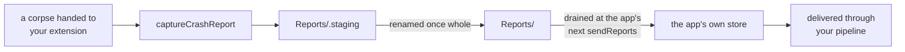

# What's New in KSCrash 3.0

3.0's headline is the Swift API, and the
[migration guide](Migration-Guide-for-KSCrash-2.6-to-3.0) maps every 2.6 symbol
to its replacement. This page is the other half: what 3.0 can do that 2.6 could
not, whether or not you are migrating.

## Telemetry and diagnostics are different things

The Swift API is the visible change. This one shapes everything else: 3.0 stops
treating the crash report as the unit of both measurement and investigation,
and splits those into two payloads with different rules.

**Telemetry is the run summary.** One per process run, crash or no crash. It
says how the run ended, how long it spent foreground and background, on which
app, OS and device, and what sessions it contained. This is what metrics are
built from: crash-free rate, session counts, how a release is behaving in the
field. Summaries are **never sampled**, because a rate computed from a sampled
denominator is not that rate.

**Diagnostics are reports**, and in 3.0 a single run can produce many of them,
from several sources at once:

- KSCrash's own handlers, for signals and Mach exceptions
- MetricKit, whose diagnostics arrive hours or days later
- an iOS 27 `CrashReportExtension` capture, written out of process
- profiles and hangs

They overlap deliberately. Two sources can describe the same crash, which is a
feature when you are trying to understand one, and a trap if you are counting.
**Do not count reports.** The number of reports a run produced is a function of
which sources you enabled and which of them happened to fire, not of how the
app behaved. Counting them measures your configuration.

What this buys you is freedom to choose. Turn MetricKit off and you can still
root-cause a run from the other sources. Use only the iOS 27 extension and skip
in-process handlers entirely. Run all of them and sample, because a diagnostic
does not need full coverage to do its job: you need enough instances of a crash
to understand it, not every instance. The run summaries keep telling you how
often it happens while the reports tell you why.

## Run summaries

2.6 told you about crashes. 3.0 also tells you about the runs that did not
crash.

Every process run produces one **run summary**, a small telemetry record
persisted on the next launch and delivered by its own send and its own
pipeline:

```swift
let summaries = try await KSCrash.shared.sendRunSummaries(with: send)
```

A summary says how the run ended (`outcome.terminationReason`), how long it
spent foreground and background (`durations.activeMs`, `.backgroundMs`), which
app, OS and device it was, and the sessions it contained. One arrives for a
clean exit as well as a crash, which is what makes it the denominator: a
backend can compute a crash-free rate rather than counting only the failures.

## Sessions

A session is one contiguous stretch of a run at a single user id and
perceptibility. A new one is cut whenever either changes, so backgrounding an
app or calling `setUserID(_:)` starts a new session.

Sessions arrive on the run summary as `sessions.records`, each carrying its own
guid, user, start and end, and whether it was user-perceptible. Every report
also carries `report.session_id` (`ReportInfo.sessionId`), the session that was
open when it was finalized, so a crash can be tied to the stretch of the run it
happened in.

## Metadata holds containers, and reports hold no nulls

The crash-safe key-value store behind `KSCrash.shared.metadata` now holds
arrays and dictionaries, not only scalars, so structured context survives a
crash without being flattened into a string first.

Alongside it, a delivered report carries **no JSON nulls at all**. The writer
omits a value it does not have, and every read the store performs resolves any
null that got in from an older or foreign writer to absence. A consumer walking
a report never needs a null check, which 2.6 could not promise. The single
exception is decoding `monitor_data`, which goes through `FaithfulMetadata`,
because a null a monitor deliberately wrote is a value and dropping it would
renumber the array around it.

## Monitor data has a namespace of its own

A monitor's data no longer risks colliding with the report schema. Delivery-time
data lands under `monitor_data.<monitorID>` at the report root, and the crashing
monitor's own section under `crash.error.monitor_data.<monitorID>`. Both survive
the typed model and read back with `monitorData(_:for:)`, so a custom monitor's
payload reaches a consumer intact instead of being dropped as unmodelled.

## Writing a monitor in Swift

2.6's plugin surface was a C `KSCrashMonitorAPI` table: C-convention closures,
`Unmanaged` context recovery, a strdup'd id, a locked enabled flag, and manual
payload boxing, hand-rolled per monitor. 3.0 adds a Swift layer
(`import KSCrashMonitorPlugins`) where a monitor is a protocol conformance:

```swift
final class MyMonitor: ReportSectionWriting {
    typealias EventPayload = MySnapshot
    static let id = "MyMonitor"

    let host: MonitorHost<MySnapshot>
    init(host: MonitorHost<MySnapshot>, configuration: Void) { self.host = host }

    func writeReportSection(payload: MySnapshot, writer: ReportSectionWriter) {
        try? writer.encode("snapshot", payload)
    }
}

config.plugins = [MyMonitor.plugin()]
```

`MonitorHost` is the typed face of the C callbacks: `handle(payload:…)` raises
an event and returns the written report, and the per-event payload is delivered
back to `writeReportSection` typed rather than as a void pointer.

### How a section gets written

`writeReportSection` is called while a report is being written, so it is worth
knowing exactly when that is.

Your monitor calls `host.handle(payload:requirements:…)`. The payload is boxed
onto the event, and the event goes through the C pipeline, which writes a
report. While writing, the writer looks up **one** monitor, the one whose id is
on the event, and calls its `writeInReportSection`. The bridge recovers itself
from the C context, unboxes the payload back to your `EventPayload`, wraps the
raw C writer in `ReportSectionWriter`, and calls you. What you write lands under
`crash.error.monitor_data.<your id>`.

Two consequences worth knowing:

- A `nil` payload writes the report **without** your section, which is what
  corpse capture uses for a snapshot-less capture.
- If your type does not conform to `ReportSectionWriting`, the bridge leaves the
  C hook `nil`, so you produce no key at all rather than an empty object.

**None of this is async-signal-safe, and it does not need to be.** Because the
writer only asks the monitor named on the event, your `writeReportSection` runs
only for events your own monitor raised, and a Swift monitor raises those from
a healthy process. A real crash arrives carrying `Signal` or `MachException`,
so the C monitor is asked and yours is not. The layer is not unsafe-but-careful;
it is unreachable from a handler.

That is also why Swift is available here at all: protocol dispatch, ARC,
allocation and locking are all off limits once a signal or Mach exception
handler is running, and this layer uses every one of them.

The crash-time monitors stay in C for that reason. If you are catching signals
or Mach exceptions, you are writing a `KSCrashMonitorAPI` table under the
async-signal-safety rules and wrapping it with `CMonitorPlugin(api:)`; the Swift
layer is not an option there, and choosing it would put a malloc in a signal
handler.

### Adding to a report later: ReportStitching

Writing a section happens while the report is being written. `ReportStitching`
is the other opportunity, at **delivery** time, when the store reads a report to
send it, typically on a later launch:

```swift
func stitchedReport(_ report: [String: Any], sidecarURL: URL?,
                    scope: SidecarScope) throws -> [String: Any]
```

This exists because of the hot-path rule. A monitor watching a running app
should write as little as it can, as cheaply as it can, usually raw bytes into
a **sidecar** file next to the report. Interpreting those bytes, turning them
into JSON and merging them into the report, is deferred to delivery, which runs
at normal startup in a healthy process where allocation and Objective-C are
fine. The watchdog does this: it cannot parse JSON while the main thread is
hung, so it updates a small mmap'd struct and stitches it in later.

You get called once per sidecar of yours, with `scope` saying which kind it was
(`.run` for a per-run sidecar, `.report` for a per-report one), and then once
more with `scope == .final` and no `sidecarURL`, after all sidecars have been
stitched, so you can adjust the report using what is now in it.

Throwing means the stitch failed: during finalization the write-back is
abandoned so the report is retried on the next read, and on a normal read the
original is kept silently. Throwing on the final pass is the same as returning
the report unchanged, since with no sidecar to reread a retry cannot go
differently.

Like section writing, this is a conformance rather than a defaulted method, and
that is deliberate. A default cannot tell a monitor that meant to implement the
method and got the signature wrong from one that had nothing to say, and the
first compiles clean and does nothing forever. A monitor that does not conform
is left out of the stitch pass entirely rather than being called to return the
report unchanged.

## Hangs as a stream

`addHangObserver:` is replaced by `KSCrash.shared.hangEvents`, an
`AsyncStream<HangEvent>`, so watching the main thread is a `for await` loop and
cancellation is structured rather than an observer you must remember to remove.

## Reports are written one at a time

An event can now declare that it would rather be dropped than have its report
written alongside one already in progress. The handler refuses it outright and
says so through `refusedReportInFlight`.

This matters for opportunistic captures, a profiler sample or an observed hang,
where losing the event costs nothing and interleaving two report writes costs
correctness. Events that must be recorded leave the flag clear and are never
refused or delayed: a report write is far longer than any wait a crash path can
afford, so waiting would buy delay and no exclusion.

## Out-of-process reporting with CrashReportExtension

Everywhere else, KSCrash writes the report from inside the dying process, in a
signal or Mach exception handler, under async-signal-safety rules. iOS 27's
`CrashReportExtension` offers the other arrangement, and 3.0 supports it.

You ship a `CrashReporterExtension`, and the system calls it after your app
dies:

```swift
func processCrashReport(process: CrashedProcess)
```

`CrashedProcess` carries the crash `reason`, the `binaryImages`, symbolication,
and a `corpsePort`, a **read-only** Mach port onto the dead process, enough to
read its threads, registers and memory. So the report is produced by a healthy
process, about a dead one, with no handler running inside the crash and none of
the async-signal-safety constraints that come with one.

The extension's bundle identifier has to be a child of the app's
(`com.example.myapp.crash-handler` for `com.example.myapp`), and its
`Info.plist` has to declare the extension point.

KSCrash captures from that corpse. The extension installs in corpse-reporting
mode and captures each `CrashedProcess` it is handed; the app lists the same
shared area and drains it on its next send.



Two targets are involved, and the only thing they share is the area: the same
`CorpseReportingConfiguration` value, built independently on each side, which is
how both derive the same directory inside the app group.

In the extension target:

```swift
import CrashReportExtension
import KSCrashCrashReportExtension

let area = CorpseReportingConfiguration(
    namespace: "MyApp",
    container: .appGroup("group.com.example.app"))

@main
struct MyCrashReporter: CrashReporterExtension {
    init() {
        try? KSCrash.shared.installForCorpseReporting(with: area)
    }

    // Called by the system after the app crashes.
    func processCrashReport(process: CrashedProcess) {
        _ = try? KSCrash.shared.captureCrashReport(from: process)
    }
}
```

In the app, at install, so the captured reports can be read back:

```swift
import KSCrash
import KSCrashCrashReportExtension

var config = InstallConfiguration(namespace: "MyApp")
config.plugins = [CrashReportExtensionMonitor.plugin()]
try KSCrash.shared.install(config)
```

and at send, so the extension's area is drained into the app's own store:

```swift
var send = SendConfiguration()
send.reportPipeline = [.init(MyUploadStage())]
send.corpseAreas = [
    CorpseReportingConfiguration(
        namespace: "MyApp",
        container: .appGroup("group.com.example.app"))
]
let result = try await KSCrash.shared.sendReports(with: send)
```

A corpse-reporting install is not a lighter app install. It arms no crash
detection, owns no run of its own, and keeps no metadata, sessions or run
summaries, because everything it reports belongs to a process that has already
died. The app-facing API is meaningless in that process; install normally
instead if what you want is an extension that reports its own crashes.

## Sending is async Swift

Delivery is `try await KSCrash.shared.sendReports(with:)` against a pipeline of
`PipelineStage`s, one payload at a time. A stage returns the payload to pass it
on, `nil` to discard it, or throws to keep it on disk for the next send, so
"try again later" is a return value rather than a sink silently swallowing a
report. The result names the ids that were delivered, discarded and kept.
