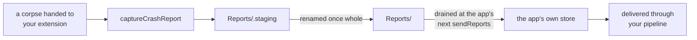

# What's New in KSCrash 3.0

3.0's headline is the Swift API, and the
[migration guide](Migration-Guide-for-KSCrash-2.6-to-3.0) maps every 2.6 symbol
to its replacement. This page is the other half: what 3.0 can do that 2.6 could
not, whether or not you are migrating.

## Run summaries

2.6 told you about crashes. 3.0 also tells you about the runs that did not
crash.

Every process run produces one **run summary**, a small telemetry record
persisted on the next launch and delivered by its own send and its own
pipeline:

```swift
let summaries = try await KSCrash.shared.sendRunSummaries(with: send)
```

A summary says how the run ended (`outcome.terminationReason`), how long it
spent foreground and background (`durations.activeMs`, `.backgroundMs`), which
app, OS and device it was, and the sessions it contained. Because one arrives
for a clean exit too, a backend can compute a crash-free rate rather than
counting only the failures.

Summaries are telemetry and are **never sampled**; reports are diagnostics and
may be. That split is deliberate: sampling the thing you compute rates from
would bias the rate.

## Sessions

A session is one contiguous stretch of a run at a single user id and
perceptibility. A new one is cut whenever either changes, so backgrounding an
app or calling `setUserID(_:)` starts a new session.

Sessions arrive on the run summary as `sessions.records`, each carrying its own
guid, user, start and end, and whether it was user-perceptible. Every report
also carries `report.session_id` (`ReportInfo.sessionId`), the session that was
open when it was finalized, so a crash can be tied to the stretch of the run it
happened in.

## Metadata holds containers, and reports hold no nulls

The crash-safe key-value store behind `KSCrash.shared.metadata` now holds
arrays and dictionaries, not only scalars, so structured context survives a
crash without being flattened into a string first.

Alongside it, a delivered report carries **no JSON nulls at all**. The writer
omits a value it does not have, and every read the store performs resolves any
null that got in from an older or foreign writer to absence. A consumer walking
a report never needs a null check, which 2.6 could not promise. The single
exception is decoding `monitor_data`, which goes through `FaithfulMetadata`,
because a null a monitor deliberately wrote is a value and dropping it would
renumber the array around it.

## Monitor data has a namespace of its own

A monitor's data no longer risks colliding with the report schema. Delivery-time
data lands under `monitor_data.<monitorID>` at the report root, and the crashing
monitor's own section under `crash.error.monitor_data.<monitorID>`. Both survive
the typed model and read back with `monitorData(_:for:)`, so a custom monitor's
payload reaches a consumer intact instead of being dropped as unmodelled.

## Writing a monitor in Swift

2.6's plugin surface was a C `KSCrashMonitorAPI` table: C-convention closures,
`Unmanaged` context recovery, a strdup'd id, a locked enabled flag, and manual
payload boxing, hand-rolled per monitor. 3.0 adds a Swift layer
(`import KSCrashMonitorPlugins`) where a monitor is a protocol conformance:

```swift
final class MyMonitor: ReportSectionWriting {
    typealias EventPayload = MySnapshot
    static let id = "MyMonitor"

    let host: MonitorHost<MySnapshot>
    init(host: MonitorHost<MySnapshot>, configuration: Void) { self.host = host }

    func writeReportSection(payload: MySnapshot, writer: ReportSectionWriter) {
        try? writer.encode("snapshot", payload)
    }
}

config.plugins = [MyMonitor.plugin()]
```

`MonitorHost` is the typed face of the C callbacks: `handle(payload:…)` raises
an event and returns the written report, and the per-event payload is delivered
back to `writeReportSection` typed rather than as a void pointer.

Section writing and stitching are separate protocols
(`ReportSectionWriting`, `ReportStitching`) rather than methods with defaults,
so a monitor that does neither leaves the corresponding C hooks null: it
produces no key at all rather than an empty object, and drops out of the stitch
pass entirely.

## Hangs as a stream

`addHangObserver:` is replaced by `KSCrash.shared.hangEvents`, an
`AsyncStream<HangEvent>`, so watching the main thread is a `for await` loop and
cancellation is structured rather than an observer you must remember to remove.

## Reports are written one at a time

An event can now declare that it would rather be dropped than have its report
written alongside one already in progress. The handler refuses it outright and
says so through `refusedReportInFlight`.

This matters for opportunistic captures, a profiler sample or an observed hang,
where losing the event costs nothing and interleaving two report writes costs
correctness. Events that must be recorded leave the flag clear and are never
refused or delayed: a report write is far longer than any wait a crash path can
afford, so waiting would buy delay and no exclusion.

## CrashReportExtension: reporting another process's corpse

Everything else here is about reporting on the process KSCrash is running in.
This is the exception: iOS 27's `CrashReportExtension` hands your extension the
**corpse** of a process that has already died, a Mach task you can still read
registers, threads and memory out of, and 3.0 can turn one into a KSCrash
report.

The extension installs in corpse-reporting mode and captures each corpse it is
given; the app lists the same shared area and drains it on its next send.



```swift
// In the extension
let area = CorpseReportingConfiguration(
    namespace: "MyApp", container: .appGroup("group.com.example.app"))
try KSCrash.shared.installForCorpseReporting(with: area)
_ = try KSCrash.shared.captureCrashReport(from: process)

// In the app
config.plugins = [CrashReportExtensionMonitor.plugin()]   // stitches at read time
send.corpseAreas = [area]                                  // same value, drained at send
```

A corpse-reporting install is not a lighter app install. It arms no crash
detection, owns no run of its own, and keeps no metadata, sessions or run
summaries, because everything it reports belongs to a process that has already
died. The app-facing API is meaningless in that process; install normally
instead if what you want is an extension that reports its own crashes.

## Sending is async Swift

Delivery is `try await KSCrash.shared.sendReports(with:)` against a pipeline of
`PipelineStage`s, one payload at a time. A stage returns the payload to pass it
on, `nil` to discard it, or throws to keep it on disk for the next send, so
"try again later" is a return value rather than a sink silently swallowing a
report. The result names the ids that were delivered, discarded and kept.
